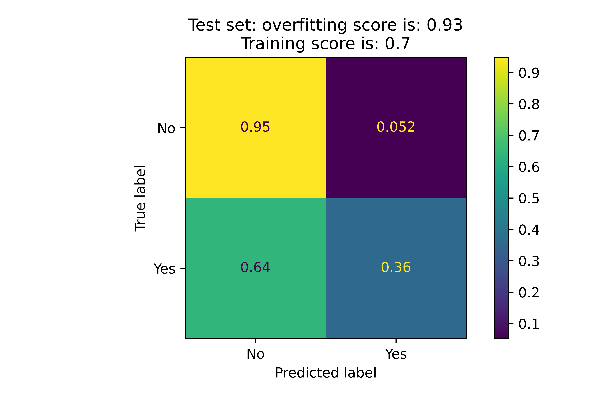
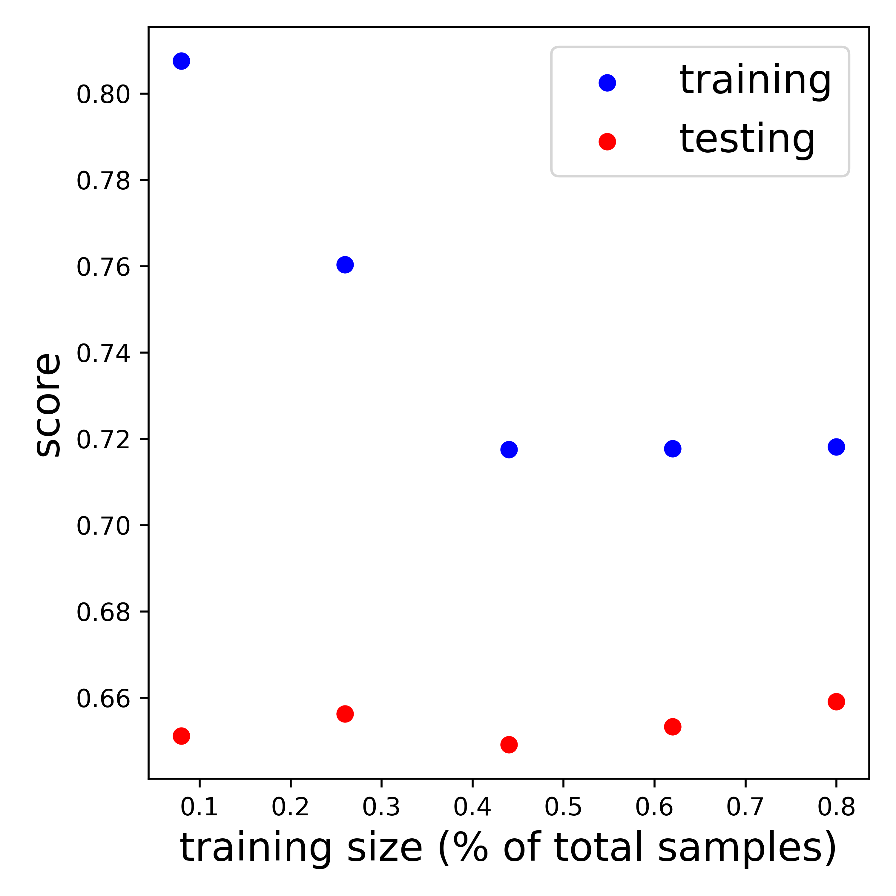

# Table of Contents
1. [Summary](#summary)
2. [Dataset](#dataset)

## Summary 
We are interested in the determining the likelihood of a client to default on their credit card. This is therefore a classification
problem with features including numerical, categorical, as well as ordinal. The repo contains a notebook that you can use to 
select features and tune hyperparameters conveniently. 

Figure 1: Test set confusion matrix. Results are normalized by the true values for each class.

Figure 2: Feature importance for the trained model.

Figure 3: Learning curve indicates our model and dataset are prone to overfitting.

## Dataset 
You can find the data [here](https://archive.ics.uci.edu/ml/datasets/default+o+credit+card+clients#).f
